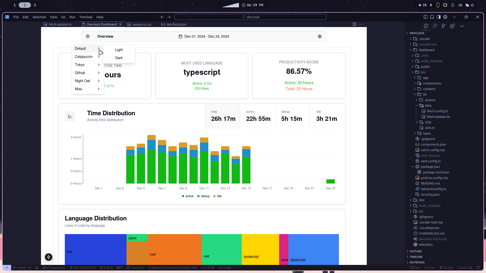
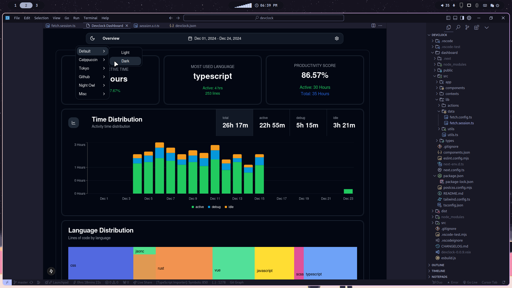
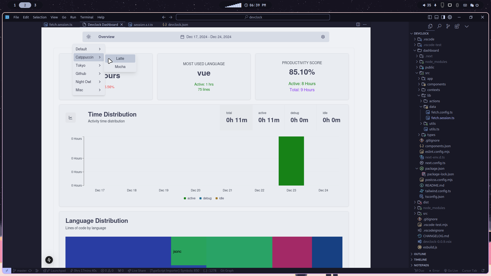
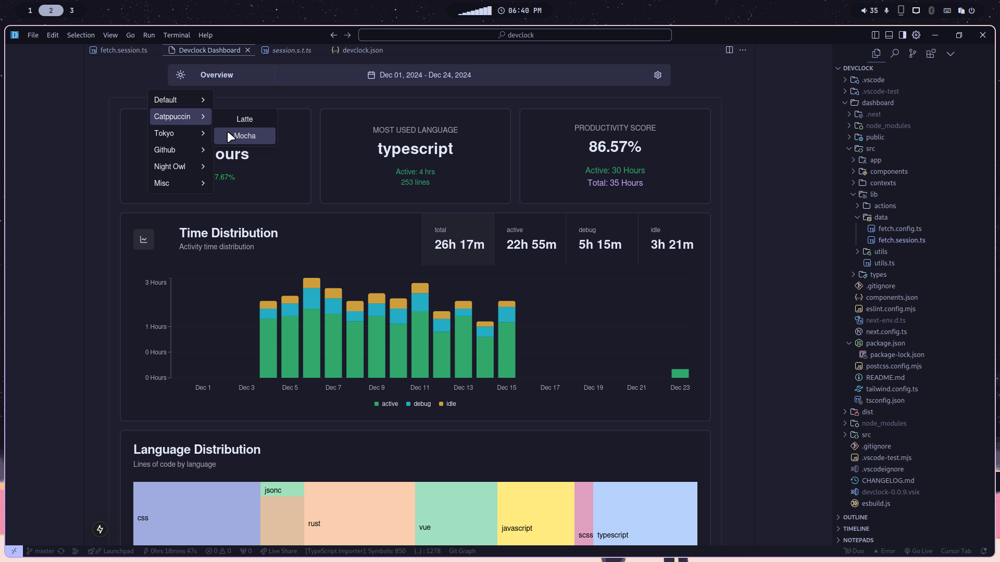
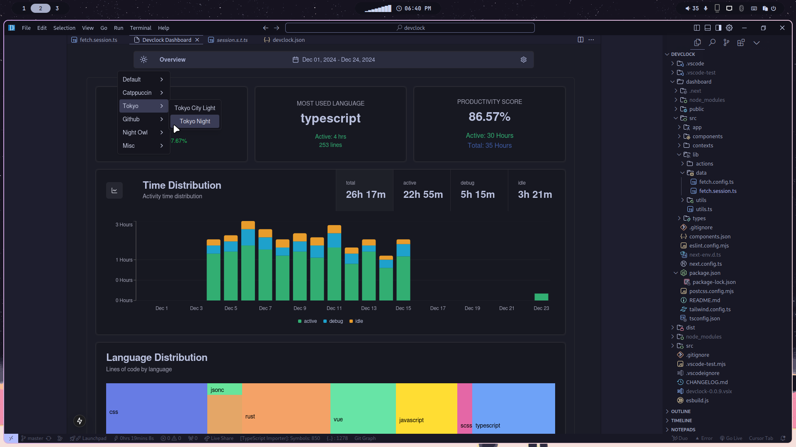
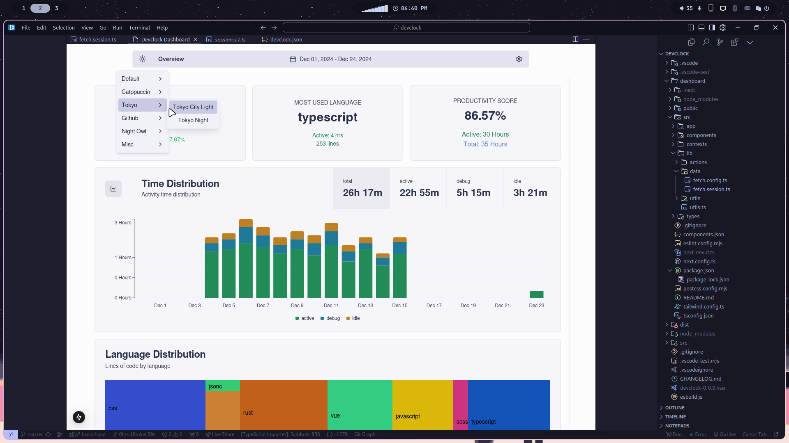
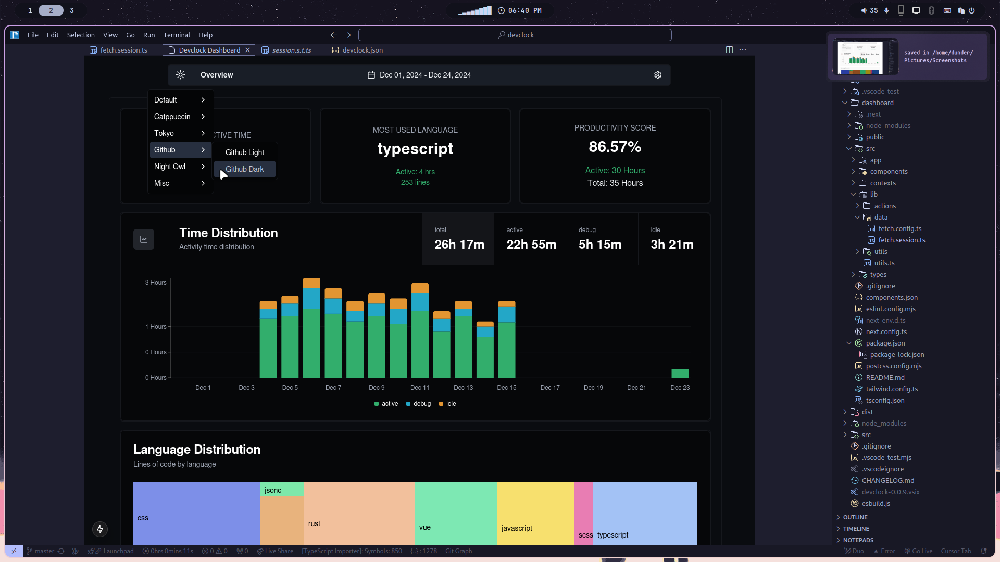
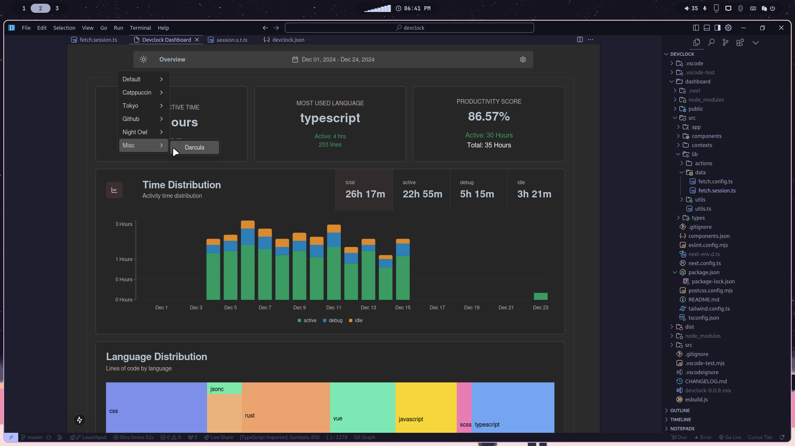

# DevClock for VSCode

DevClock is an open-source developer time tracking extension for Visual Studio Code that helps you track coding sessions. Unlike cloud-based alternatives, DevClock stores all data locally and provides analytics directly within VSCode.

## Motivation

I've been using [WakaTime](https://wakatime.com/) for a while now, and it's a great tool for tracking time. However, I've found that I don't want to pay for a subscription to view historical data. I wanted to create a local solution that would enable persitant historical time tracking all locally, free, and with customizability.

So, I decided to build my own tool.

## Key Features

-   **Local-First**: All your development data is stored locally on your machine
-   **Real-Time Tracking**: Automatically tracks active coding time, debugging sessions, and idle periods
    -   Live Timer in the Status Bar
-   **Language Analytics**: Monitor time spent in different programming languages
-   **Built-in Dashboard**: View stats and visualizations directly in VSCode
    -   Activity timelines & Language Metrics
    -   ShadCN Charts
    -   Custom Themes
-   **Entirely Free**: No account required, analyze unlimited time periods
-   **Customizable Settings**: Configure idle timeout, data sync interval, and timer placement

The extension runs silently in the background while you code, collecting metrics about your development sessions. Access your statistics anytime through the integrated dashboard by running the `DevClock: Show Dashboard` command.

## Requirements

-   **NPM**: The DevClock Dashboard uses Next.js and ShadCN UI, and is not bundled with the extension. When you run the Show Dashboard command, the Dashboard will be cloned down from Github to your to the extensions global storage provided by the editor. A child process then runs npm install and npm run dev to start the Next.js server. NPM must be installed on your machine to run the Dashboard.

## Extension Settings

Available DevClock settings:

-   `devclock.config.npmPath`: Path to the npm executable, only needs to be set if the extension cannot find it.
    -   Default: `npm`
-   `devclock.config.debugMode`: Enable/disable debug mode, useful if you are contributing to the extension.
    -   Default: `false`
-   `devclock.config.syncTimeScale`: Interval for syncing session data to local storage.
    -   Default: `5 minutes`
-   `devclock.config.idleThreshold`: Activity threshold for transitioning to idle state.
    -   Default: `15 minutes`
-   `devclock.interface.showTimer`: Show the timer in the status bar.
    -   Default: `true`
-   `devclock.interface.timerAlignment`: Alignment of the timer in the status bar.
    -   Default: `Left`

Available DevClock commands:

-   `DevClock: Show Dashboard`: Show the DevClock Dashboard.
-   `DevClock: Force Sync`: Force a sync of the current session data to local storage.

## Release Notes

### 1.0.0

Initial release of DevClock.

## Planned Features

-   [ ] Add the ability to add custom themes
-   [ ] Add the ability to sync/read data to/from a remote server
-   [ ] Add dashboard views for Activity and Language specific metrics
-   [ ] Improve the theme switcher to be a theme modal with live preview
-   [ ] Implement user settings to allow for further customization and control

## Themes

-   [x] Catppuccin
-   [x] Tokyo City
-   [x] Github
-   [x] Owl
-   [x] Darcula

## Theme Images

Default Light and Dark themes

Catppuccin Latte and Mocha themes

Tokyo Night and Light themes

Github Dark and Light themes

Owl Dark and Light themes

Darcula theme

